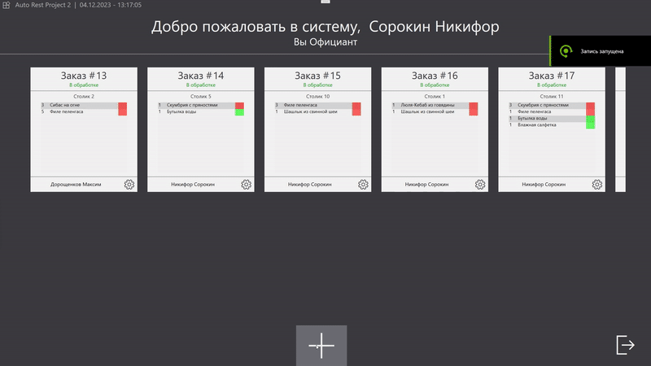
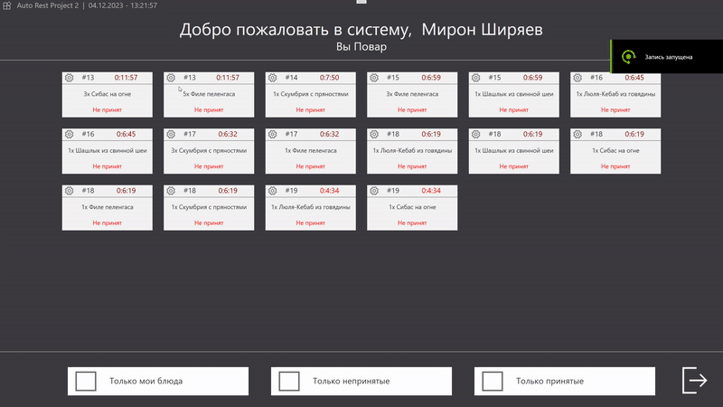
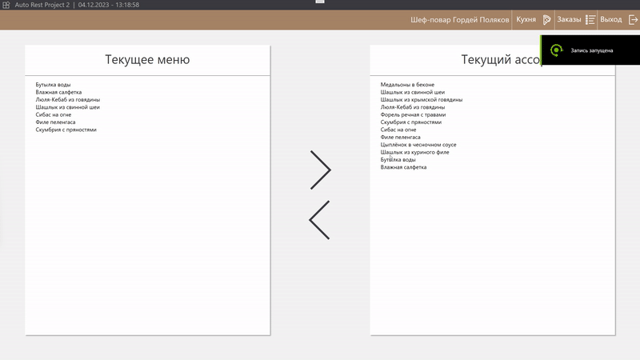
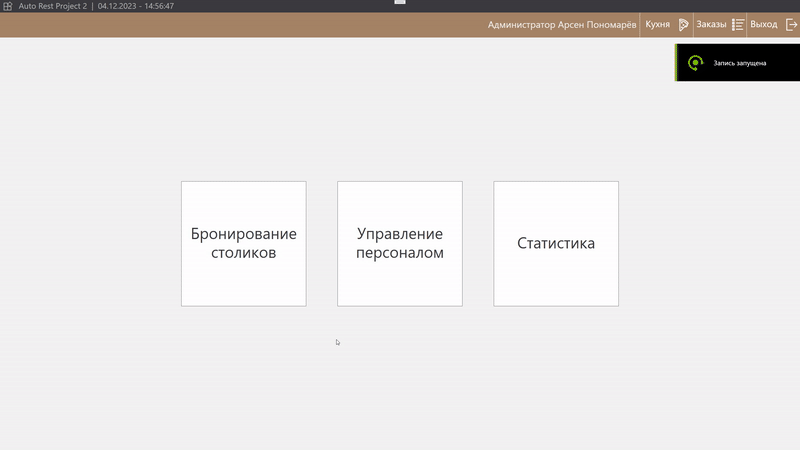

# AutoRestProject Средство управления рестораном
  Программа предназначена для управления рестораном.  
  Все основное управление может осуществляться только при помощи мыши, что делает возможным управление при помощи сенсорного экрана.  
  
  Программа разделена на 4 основных экрана. Каждый из которых соответствует роли сотрудника.  
  Первоначально сотрудника встречает экран авторизации, на котором также присутствует краткая сводка и справка.

### Экран официанта
Официант способен принимать заказы, выбирая определённые блюда и столик.  
  

  
### Экран повара
Повар видит список блюд, которые нужно приготовить. Он может отметить принятие блюда в готовку или отменить.
  

  
### Экран шеф-повара  
Шеф-повар способен управлять ассортиментом блюд и текущим меню. Шеф-повар также способен переходить в экраны официантов и поваров.

### Экран администратора
Администратор способен:
 - Добавлять в систему столики, бронировать их или снимать бронь
 - Управлять персоналом (добавление, редактирование, удаление)
 - Просматривать статистику по поварам (количество приготовленных блюд за текущие сутки) и по официантам (количество закрытых заказов за сутки), а также выгружать данную статистику
 - Переходить на экран Повара, Официанта

 

## База данных  

  
В качестве базы данных используется SQL Server. База данных состоит из следующих сущностей:
  
- Таблица «menu_strings» хранит информацию о строках меню
  
|     Имя поля    |     Тип     поля    |     Размер поля,     байт    |     Описание поля                |
|-----------------|---------------------|------------------------------|----------------------------------|
|     id          |     int             |     4                        |     Идентификатор строки меню    |
|     FoodId      |     int             |     4                        |     Идентификатор блюда          |

- Таблица «foods» хранит информацию о блюдах ресторана  
  
|     Имя поля      |     Тип     поля    |     Размер поля,     байт    |     Описание поля               |
|-------------------|---------------------|------------------------------|---------------------------------|
|     id            |     int             |     4                        |     Идентификатор блюда         |
|     title         |     nvarchar        |     30                       |     Наименование блюда          |
|     price         |     float           |     8                        |     Цена блюда, BYN             |
|     is_cooking    |     BIT             |     1                        |     Требование приготовления    |
  
- Таблица «order_strings» хранит информацию о строках заказов  
  
|     Имя поля    |     Тип     поля    |     Размер поля,     байт    |     Описание поля                  |
|-----------------|---------------------|------------------------------|------------------------------------|
|     id          |     int             |     4                        |     Идентификатор номера строки    |
|     FoodId      |     int             |     4                        |     Идентификатор блюда            |
|     OrderId     |     int             |     4                        |     Идентификатор заказа           |

- Таблица «orders» хранит информацию о заказах  
  
|     Имя поля          |     Тип     поля    |     Размер поля,     байт    |     Описание поля                   |
|-----------------------|---------------------|------------------------------|-------------------------------------|
|     id                |     int             |     4                        |     Идентификатор номера строки     |
|     time              |     nvarchar        |     12                       |     Время заказа                    |
|     date              |     nvarchar        |     12                       |     Дата заказа                     |
|     action            |     nvarchar        |     30                       |     Описание действия               |
|     Order_StatusId    |     int             |     4                        |     Идентификатор статуса заказа    |
|     PersonalId        |     int             |     4                        |     Идентификатор работника         |

- Таблица «tables» хранит информацию о столиках

|     Имя поля          |     Тип     поля    |     Размер поля,     байт    |     Описание поля                    |
|-----------------------|---------------------|------------------------------|--------------------------------------|
|     id                |     int             |     4                        |     Идентификатор номера строки      |
|     seats             |     int             |     4                        |     Количество мест за столиком      |
|     Table_StatusId    |     int             |     4                        |     Идентификатор статуса столика    |
  
- Таблица «table_statuses» хранит информацию о состояниях столиков  

|     Имя поля    |     Тип     поля    |     Размер поля,     байт    |     Описание поля                      |
|-----------------|---------------------|------------------------------|----------------------------------------|
|     id          |     int             |     4                        |     Идентификатор состояния столика    |
|     title       |     nvarchar        |     16                       |     Наименование состояния             |

- Таблица «order_statuses» хранит информацию о состояниях заказов  
  
|     Имя поля    |     Тип     поля    |     Размер поля,     байт    |     Описание поля                      |
|-----------------|---------------------|------------------------------|----------------------------------------|
|     id          |     int             |     4                        |     Идентификатор состояния заказа     |
|     title       |     nvarchar        |     16                       |     Наименование состояния             |

- Таблица «checks» хранит информацию о счетах

|     Имя поля    |     Тип     поля    |     Размер поля,     байт    |     Описание поля                     |
|-----------------|---------------------|------------------------------|---------------------------------------|
|     id          |     int             |     4                        |     Идентификатор состояния заказа    |
|     summa       |     float           |     8                        |     Сумма заказа, BYN                 |
|     OrderId     |     int             |     4                        |     Идентификатор заказа              |

- Таблица «positions» хранит информацию о должностях  

|     Имя поля    |     Тип     поля    |     Размер поля,     байт    |     Описание поля              |
|-----------------|---------------------|------------------------------|--------------------------------|
|     id          |     int             |     4                        |     Идентификатор должности    |
|     title       |     nvarchar        |     16                       |     Наименование должности     |
  
- Таблица «personals» хранит информацию о персонале
  
|     Имя поля        |     Тип     поля    |     Размер поля,     байт    |     Описание поля              |
|---------------------|---------------------|------------------------------|--------------------------------|
|     id              |     int             |     4                        |     Идентификатор должности    |
|     first_name      |     nvarchar        |     16                       |     Наименование должности     |
|     second_name     |     nvarchar        |     32                       |     Имя сотрудника             |
|     patronymic      |     nvarchar        |     24                       |     Фамилия сотрудника         |
|     phone_number    |     nvarchar        |     16                       |     Отчество сотрудника        |
|     pin             |     int             |     4                        |     ПИН-код сотрудника         |
|     PositionId      |     int             |     4                        |     Идентификатор должности    |
